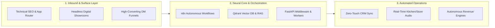

<div align="center">

# ⚡ Alfaz Mahmud Rizve

<a href="https://whoisalfaz.me">
  
</a>

<p align="center">
  <strong>"Control. Connect. Conquer."</strong><br>
  <em>Bridging technical SEO, high-speed Next.js web applications, and self-healing n8n RevOps pipelines for scaling brands.</em>
</p>

[](https://whoisalfaz.me)
[](https://www.linkedin.com/in/alfaz-mahmud-rizve/)
[](https://x.com/whois_alfaz)
[](mailto:a.m.rizve3905@gmail.com)

</div>

---

## 🏛️ Autonomous Revenue Architecture

The unified framework connecting discovery, intelligence, and automated execution:



---

## 💎 Flagship Systems & Live Deployments

Production-grade web platforms, self-hosted AI stacks, and headless applications featured on [whoisalfaz.me](https://whoisalfaz.me):

<table>
  <tr>
    <td width="50%" valign="top">
      <h3>🏛️ Heaven Atelier</h3>
      <p><em>Luxury interior & bespoke joinery digital showroom with real-time consultation drawer and timber grain lens.</em></p>
      <p>
        
        
        
      </p>
      <p>
        🔗 <a href="https://heaven.whoisalfaz.me"><strong>Live Experience</strong></a> • 
        📦 <a href="https://github.com/AlfazMahmudRizve/heaven-furniture-atelier">Code Repository</a>
      </p>
    </td>
    <td width="50%" valign="top">
      <h3>⚡ n8n Qdrant Bridge</h3>
      <p><em>High-throughput FastAPI bridge connecting n8n automation workflows with Qdrant vector database for self-hosted RAG.</em></p>
      <p>
        
        
        
      </p>
      <p>
        🔗 <a href="https://whoisalfaz.me/blog/pinecone-vs-qdrant-vultr-benchmark/"><strong>Latency Benchmark</strong></a> • 
        📦 <a href="https://github.com/AlfazMahmudRizve/n8n-qdrant-fastapi-bridge">Code Repository</a>
      </p>
    </td>
  </tr>
  <tr>
    <td width="50%" valign="top">
      <h3>🍳 Urban Harvest Cafe</h3>
      <p><em>Zero-hardware restaurant OS with real-time Supabase order queues and browser-native Text-to-Speech audio routing.</em></p>
      <p>
        
        
        
      </p>
      <p>
        🔗 <a href="https://urbancafe.whoisalfaz.me"><strong>Live FoodTech PWA</strong></a> • 
        📦 <a href="https://github.com/AlfazMahmudRizve/Urban-Harvest-Cafe">Code Repository</a>
      </p>
    </td>
    <td width="50%" valign="top">
      <h3>🛡️ Enterprise RAG Stack</h3>
      <p><em>Production self-hosted Enterprise RAG cluster with Qdrant, Dify AI Studio, Ollama, and Caddy Auto-HTTPS on Vultr.</em></p>
      <p>
        
        
        
      </p>
      <p>
        🔗 <a href="https://whoisalfaz.me/blog/self-hosted-qdrant-docker-vultr/"><strong>Architecture SOP</strong></a> • 
        📦 <a href="https://github.com/AlfazMahmudRizve/enterprise-rag-vultr-docker">Code Repository</a>
      </p>
    </td>
  </tr>
  <tr>
    <td width="50%" valign="top">
      <h3>✨ Veloryc Skincare</h3>
      <p><em>Headless e-commerce platform with interactive diagnostic skin quiz, dynamic variant engine, and high-conversion sliding cart.</em></p>
      <p>
        
        
        
      </p>
      <p>
        🔗 <a href="https://veloryc.whoisalfaz.me"><strong>Live Storefront</strong></a> • 
        📦 <a href="https://github.com/AlfazMahmudRizve/veloryc">Code Repository</a>
      </p>
    </td>
    <td width="50%" valign="top">
      <h3>🔍 Headless SEO Auditor</h3>
      <p><em>Automated technical SEO crawler & auditor for Next.js App Router, SSR, and Headless CMS platforms (free Screaming Frog alternative).</em></p>
      <p>
        
        
        
      </p>
      <p>
        🔗 <a href="https://whoisalfaz.me/audit/"><strong>Launch Audit Engine</strong></a> • 
        📦 <a href="https://github.com/AlfazMahmudRizve/headless-nextjs-seo-auditor">Code Repository</a>
      </p>
    </td>
  </tr>
  <tr>
    <td width="50%" valign="top">
      <h3>🕶️ Spectre 3D Commerce</h3>
      <p><em>Cinema-quality 3D product disassembly with locked 60FPS fluid scroll and custom progressive buffering engine.</em></p>
      <p>
        
        
        
      </p>
      <p>
        🔗 <a href="https://spectre.whoisalfaz.me"><strong>Live 3D Experience</strong></a> • 
        📦 <a href="https://github.com/AlfazMahmudRizve/Spectre">Code Repository</a>
      </p>
    </td>
    <td width="50%" valign="top">
      <h3>📈 CashOps.app</h3>
      <p><em>Developer-focused personal finance telemetry with optimistic UI balance updates and multi-account ledger normalization.</em></p>
      <p>
        
        
        
      </p>
      <p>
        🔗 <a href="https://cashops.whoisalfaz.me"><strong>Live Dashboard</strong></a> • 
        📦 <a href="https://github.com/AlfazMahmudRizve/CashOps.app">Code Repository</a>
      </p>
    </td>
  </tr>
</table>

---

## 🛠️ The Technical Arsenal

<div align="center">

| Core Pillar | Technologies & Frameworks |
| :--- | :--- |
| **Frontend Architecture** | `Next.js 15` `React 19` `TypeScript` `Tailwind CSS v4` `React Three Fiber` `Lenis Scroll` |
| **Automation & RevOps** | `n8n Orchestration` `FastAPI` `Python 3.11+` `PostgreSQL` `Supabase` `Webhooks` |
| **AI, RAG & Vectors** | `Qdrant Vector DB` `Dify AI Studio` `Ollama Local LLMs` `Google Gemini API` `LangChain` |
| **Cloud Infrastructure** | `Docker` `Vultr Cloud` `Caddy Auto-HTTPS` `Vercel Edge` `Linux Debian` |

</div>

---

## 🤝 Let's Build

Ready to deploy autonomous RevOps pipelines, self-hosted AI agents, or high-performance headless architecture?

```bash
$ curl -s https://whoisalfaz.me/api/contact
```

- 🌐 **Platform & Case Studies:** [whoisalfaz.me](https://whoisalfaz.me)
- 💼 **LinkedIn:** [Alfaz Mahmud Rizve](https://www.linkedin.com/in/alfaz-mahmud-rizve/)
- 🐦 **X (Twitter):** [@whois_alfaz](https://x.com/whois_alfaz)
- 📧 **Direct Email:** [a.m.rizve3905@gmail.com](mailto:a.m.rizve3905@gmail.com)
- 📍 **Base:** Chattogram, Bangladesh *(Available Worldwide)*
